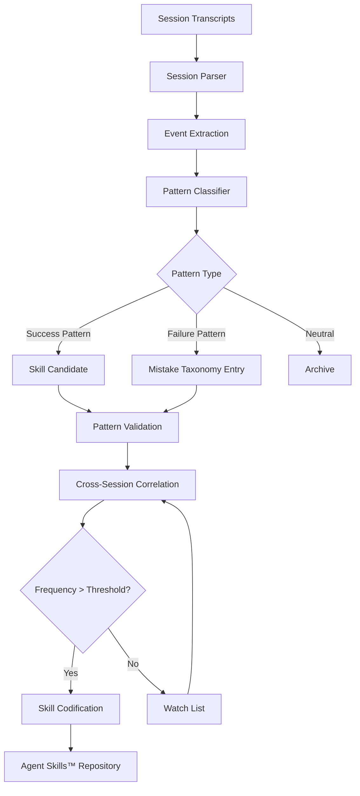

# Session Archaeology

Part of [Agent Skills™](https://github.com/itallstartedwithaidea/agent-skills) by [googleadsagent.ai™](https://googleadsagent.ai)

## Description

Session Archaeology is the systematic excavation and analysis of past agent sessions to extract reusable patterns, identify recurring failure modes, and derive new skills from operational history. Every agent session produces a rich artifact — a complete transcript of reasoning, tool usage, errors, corrections, and final outcomes. Most teams discard this data. Session Archaeology treats it as the most valuable training signal available: real-world execution traces from your specific domain, your specific codebase, and your specific workflows.

This skill formalizes the methodology used at [googleadsagent.ai™](https://googleadsagent.ai) to continuously improve Buddy™ by mining thousands of past Google Ads analysis sessions. The archaeology process identifies which prompt patterns led to accurate recommendations, which tool call sequences completed reliably, and which error recovery strategies succeeded. These findings are then codified into new Agent Skills™ or refinements to existing ones, creating a flywheel of continuous improvement.

The process operates at three levels: individual session review (what went wrong in this specific run), cross-session pattern analysis (what patterns recur across many runs), and trend identification (how is agent behavior evolving over time). Each level yields different insights and different types of improvements.

## Use When

- Agent quality has plateaued and you need new optimization signals
- You want to derive new skills or rules from real execution data
- Recurring failures suggest systematic issues rather than random errors
- Onboarding new team members who need to understand agent behavior patterns
- Building regression test suites from real session transcripts
- Preparing for model version migrations (comparing behavior across model versions)

## How It Works



The archaeology workflow begins with parsing raw session transcripts into structured event streams — each tool call, each model response, each error, each human intervention becomes a discrete event. A pattern classifier assigns each event sequence a type: success patterns (tool chains that reliably accomplish tasks), failure patterns (recurring errors with identifiable root causes), and neutral patterns (neither clearly good nor bad). Success and failure patterns enter validation, where they are cross-correlated across sessions. Patterns exceeding a frequency threshold are codified into formal skills or rules.

## Implementation

**Session Transcript Parser:**

```python
from dataclasses import dataclass, field
from typing import Literal

@dataclass
class SessionEvent:
    timestamp: str
    event_type: Literal["tool_call", "model_response", "error", "human_input", "correction"]
    content: dict
    duration_ms: int = 0
    token_count: int = 0
    success: bool = True

@dataclass
class ParsedSession:
    session_id: str
    events: list[SessionEvent] = field(default_factory=list)
    total_tokens: int = 0
    total_duration_ms: int = 0
    outcome: Literal["success", "partial", "failure"] = "success"

def parse_session_transcript(transcript_path: str) -> ParsedSession:
    with open(transcript_path) as f:
        lines = [json.loads(line) for line in f if line.strip()]

    session = ParsedSession(session_id=transcript_path)
    for entry in lines:
        event = SessionEvent(
            timestamp=entry.get("timestamp", ""),
            event_type=classify_event_type(entry),
            content=entry,
            duration_ms=entry.get("duration_ms", 0),
            token_count=entry.get("usage", {}).get("total_tokens", 0),
            success=not entry.get("error"),
        )
        session.events.append(event)
        session.total_tokens += event.token_count
        session.total_duration_ms += event.duration_ms

    session.outcome = determine_outcome(session.events)
    return session
```

**Pattern Extraction Engine:**

```python
class PatternExtractor:
    def __init__(self, min_frequency=3, min_confidence=0.7):
        self.min_frequency = min_frequency
        self.min_confidence = min_confidence
        self.pattern_store = {}

    def extract_tool_sequences(self, sessions: list[ParsedSession]) -> list[dict]:
        sequences = []
        for session in sessions:
            tool_events = [e for e in session.events if e.event_type == "tool_call"]
            for window_size in range(2, min(6, len(tool_events) + 1)):
                for i in range(len(tool_events) - window_size + 1):
                    seq = tuple(e.content.get("tool_name") for e in tool_events[i:i + window_size])
                    success = all(e.success for e in tool_events[i:i + window_size])
                    sequences.append({"sequence": seq, "success": success, "session": session.session_id})
        return self.aggregate_sequences(sequences)

    def aggregate_sequences(self, sequences):
        counts = {}
        for seq in sequences:
            key = seq["sequence"]
            if key not in counts:
                counts[key] = {"total": 0, "success": 0, "sessions": set()}
            counts[key]["total"] += 1
            counts[key]["success"] += int(seq["success"])
            counts[key]["sessions"].add(seq["session"])

        patterns = []
        for seq, stats in counts.items():
            if stats["total"] >= self.min_frequency:
                confidence = stats["success"] / stats["total"]
                if confidence >= self.min_confidence:
                    patterns.append({
                        "sequence": seq,
                        "frequency": stats["total"],
                        "confidence": confidence,
                        "sessions": len(stats["sessions"]),
                    })
        return sorted(patterns, key=lambda p: p["confidence"] * p["frequency"], reverse=True)
```

**Mistake Taxonomy Builder:**

```python
class MistakeTaxonomy:
    CATEGORIES = {
        "hallucination": {"description": "Model generated factually incorrect content"},
        "tool_misuse": {"description": "Wrong tool selected or incorrect parameters"},
        "context_loss": {"description": "Agent lost track of prior context or instructions"},
        "scope_creep": {"description": "Agent exceeded the boundaries of the task"},
        "format_violation": {"description": "Output did not match required format"},
    }

    def __init__(self):
        self.entries = []

    def classify_mistake(self, event: SessionEvent, context: list[SessionEvent]) -> dict:
        error_text = str(event.content.get("error", ""))
        prev_events = context[-5:]
        category = self.match_category(error_text, prev_events)
        return {
            "category": category,
            "event": event,
            "context_window": prev_events,
            "suggested_fix": self.suggest_fix(category, error_text),
        }

    def suggest_fix(self, category: str, error_text: str) -> str:
        fixes = {
            "hallucination": "Add verification loop with ground-truth checking",
            "tool_misuse": "Add pre-flight tool parameter validation",
            "context_loss": "Implement context checkpointing between stages",
            "scope_creep": "Add task boundary assertions in system prompt",
            "format_violation": "Add schema grader to verification pipeline",
        }
        return fixes.get(category, "Review and add specific guard for this error type")
```

## Best Practices

1. **Parse sessions automatically** — set up hooks that parse and index every session transcript immediately after completion; stale data loses value.
2. **Focus on failure modes first** — success patterns are useful, but failure patterns yield the highest-impact improvements per engineering hour.
3. **Build a living mistake taxonomy** — maintain a categorized, searchable database of every failure type with suggested fixes and occurrence counts.
4. **Require minimum frequency** — a pattern observed once could be noise; require at least 3 occurrences across different sessions before codifying a skill.
5. **Track pattern evolution over time** — a failure pattern that is increasing in frequency indicates a regression; one that is decreasing validates a recent fix.
6. **Derive skills from successful tool sequences** — if the same 3-tool sequence appears in 80% of successful sessions, codify it as a recommended workflow.
7. **Anonymize before sharing** — session transcripts contain user data, API keys, and business logic; strip sensitive content before cross-team analysis.

## Platform Compatibility

| Feature | Claude Code | Cursor | Codex | Gemini CLI |
|---|---|---|---|---|
| Session transcript access | ✅ JSONL logs | ✅ Agent transcripts | ✅ Execution logs | ✅ Session logs |
| Automated parsing | ✅ Hooks | ✅ Extensions | ✅ Scripts | ✅ Scripts |
| Cross-session analysis | ✅ Full | ✅ Full | ✅ Full | ✅ Full |
| Pattern extraction | ✅ Full | ✅ Full | ✅ Full | ✅ Full |
| Skill derivation | ✅ SKILL.md | ✅ SKILL.md | ✅ Instructions | ✅ System prompts |

## Related Skills

- [Verification Loops](../verification-loops/) - Grader outputs that feed into session archaeology as structured evaluation data for pattern mining
- [Cognitive Scaffolding](../cognitive-scaffolding/) - Attention patterns validated through archaeological analysis of which scaffold zones produce best results
- [Context Engineering](../context-engineering/) - Token usage patterns mined from session transcripts to optimize context budget allocation

## Keywords

session-archaeology, pattern-mining, mistake-taxonomy, session-analysis, skill-derivation, cross-session-analysis, agent-improvement, transcript-parsing, failure-analysis, agent-skills

---

© 2026 [googleadsagent.ai™](https://googleadsagent.ai) | [Agent Skills™](https://github.com/itallstartedwithaidea/agent-skills) | MIT License
