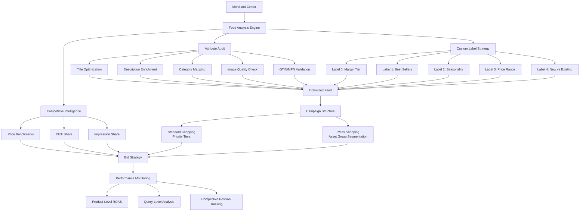

# Shopping Ads

Part of [Agent Skills™](https://github.com/itallstartedwithaidea/agent-skills) by [googleadsagent.ai™](https://googleadsagent.ai)

## Description

The Shopping Ads skill delivers end-to-end management of Google Shopping campaigns and Merchant Center product feeds. Shopping ads are the highest-intent ad format in Google's ecosystem — users see the product image, price, and merchant name before clicking, resulting in qualified traffic with strong purchase intent. The difference between mediocre and exceptional Shopping performance almost always comes down to feed quality and campaign structure.

Product feed optimization is the foundation. The skill audits every feed attribute — title, description, product type, Google product category, GTINs, custom labels, images, pricing, availability — against Google's requirements and competitive best practices. Titles are optimized with search-relevant attributes (brand, color, size, material) front-loaded for maximum visibility. Descriptions are enriched with long-tail query-matching terms. Custom labels enable performance-based segmentation (margin tiers, best sellers, seasonal items) that powers intelligent bidding strategies.

Campaign structure extends feed optimization into bid management. The skill designs Shopping campaign architectures using priority settings, custom label segmentation, and negative keyword sculpting to control which products match which queries at what bids. For Standard Shopping, this means tiered campaigns with query-level control. For PMax Shopping, it means asset group segmentation aligned with product performance clusters. Supplemental feeds, competitive pricing intelligence, local inventory ads, and free listings round out the comprehensive Shopping strategy.

## Use When

- User asks about "Shopping ads" or "Shopping campaigns"
- User mentions "product feed" or "Merchant Center"
- User wants to "optimize product titles" or "improve feed quality"
- User asks about "custom labels" or "supplemental feeds"
- User mentions "product disapprovals" or "Merchant Center errors"
- User wants to "improve Shopping ROAS" or "reduce Shopping CPA"
- User asks about "competitive pricing" or "price benchmarks"
- User mentions "local inventory ads" or "free listings"
- User wants to "segment products" by performance

## Architecture



## Implementation

Product feed audit and optimization engine:

```javascript
async function auditProductFeed(merchantId) {
  const products = await getMerchantProducts(merchantId);
  const diagnostics = await getFeedDiagnostics(merchantId);

  const audit = {
    totalProducts: products.length,
    activeProducts: products.filter(p => p.status === 'active').length,
    disapproved: products.filter(p => p.status === 'disapproved'),
    warnings: diagnostics.warnings,
    attributeAnalysis: analyzeAttributes(products),
    titleOptimization: auditTitles(products),
    descriptionQuality: auditDescriptions(products),
    imageQuality: auditImages(products),
    pricingAnalysis: analyzePricing(products),
    customLabelStrategy: designCustomLabels(products)
  };

  return audit;
}

function auditTitles(products) {
  const issues = [];

  for (const product of products) {
    const title = product.title;

    if (title.length < 25) {
      issues.push({ productId: product.id, issue: 'Title too short', current: title });
    }
    if (title.length > 150) {
      issues.push({ productId: product.id, issue: 'Title exceeds optimal length', current: title });
    }
    if (!title.toLowerCase().includes(product.brand?.toLowerCase())) {
      issues.push({ productId: product.id, issue: 'Brand missing from title', current: title });
    }

    const optimizedTitle = buildOptimizedTitle(product);
    if (optimizedTitle !== title) {
      issues.push({
        productId: product.id,
        issue: 'Title can be optimized',
        current: title,
        recommended: optimizedTitle
      });
    }
  }

  return { issues, optimizationRate: issues.length / products.length };
}

function buildOptimizedTitle(product) {
  const components = [
    product.brand,
    product.title.replace(product.brand, '').trim(),
    product.color,
    product.size,
    product.material,
    product.gender
  ].filter(Boolean);

  const optimized = components.join(' - ');
  return optimized.substring(0, 150);
}

function designCustomLabels(products) {
  const performanceData = products.map(p => ({
    id: p.id,
    revenue: p.revenue30d,
    cost: p.cost30d,
    roas: p.revenue30d / Math.max(p.cost30d, 0.01),
    margin: p.margin,
    clicks: p.clicks30d,
    conversions: p.conversions30d
  }));

  return {
    customLabel0: {
      name: 'Margin Tier',
      values: assignMarginTiers(performanceData),
      biddingImplication: 'Higher bids on high-margin products'
    },
    customLabel1: {
      name: 'Performance Tier',
      values: assignPerformanceTiers(performanceData),
      biddingImplication: 'Aggressive bids on top performers, reduced on low performers'
    },
    customLabel2: {
      name: 'Seasonality',
      values: assignSeasonality(products),
      biddingImplication: 'Boost seasonal products during peak periods'
    },
    customLabel3: {
      name: 'Price Competitiveness',
      values: assignPriceCompetitiveness(products),
      biddingImplication: 'Higher bids when price-competitive, lower when overpriced'
    },
    customLabel4: {
      name: 'Product Lifecycle',
      values: products.map(p => ({
        productId: p.id,
        label: p.daysListed < 30 ? 'new_arrival' : p.daysListed > 180 ? 'clearance' : 'established'
      })),
      biddingImplication: 'Promotional bids for new arrivals and clearance'
    }
  };
}
```

Supplemental feed and competitive pricing:

```javascript
function buildSupplementalFeed(products, enrichmentData) {
  return products.map(product => ({
    id: product.id,
    custom_label_0: enrichmentData[product.id]?.marginTier,
    custom_label_1: enrichmentData[product.id]?.performanceTier,
    custom_label_2: enrichmentData[product.id]?.seasonality,
    custom_label_3: enrichmentData[product.id]?.priceCompetitiveness,
    custom_label_4: enrichmentData[product.id]?.lifecycle,
    sale_price: enrichmentData[product.id]?.promotionalPrice,
    promotion_id: enrichmentData[product.id]?.activePromotion
  }));
}

function analyzeCompetitivePricing(products, benchmarkData) {
  return products.map(product => {
    const benchmark = benchmarkData[product.id];
    if (!benchmark) return { productId: product.id, status: 'no_benchmark_data' };

    const pricePosition = product.price / benchmark.benchmarkPrice;

    return {
      productId: product.id,
      yourPrice: product.price,
      benchmarkPrice: benchmark.benchmarkPrice,
      priceIndex: pricePosition,
      status: pricePosition <= 0.95 ? 'price_leader'
        : pricePosition <= 1.05 ? 'competitive'
        : pricePosition <= 1.15 ? 'slightly_above'
        : 'overpriced',
      clickShareImpact: estimateClickShareImpact(pricePosition),
      recommendation: pricePosition > 1.15
        ? 'Consider price reduction or value-add messaging'
        : 'Maintain current pricing strategy'
    };
  });
}
```

## Integration with Buddy™ Agent

Shopping Ads is a core e-commerce skill within Buddy™ Agent. The platform connects directly to Merchant Center, running continuous feed audits that detect disapprovals, attribute issues, and optimization opportunities in real time. When products get disapproved, Buddy™ immediately notifies the user with the specific violation and a fix recommendation.

Buddy™ automates supplemental feed management, updating custom labels based on rolling performance data without manual CSV uploads. The platform generates and applies custom label assignments on a configurable schedule (daily or weekly), ensuring bid strategies always reflect current product performance.

For competitive pricing, Buddy™ monitors price benchmark data and alerts users when their products become uncompetitive. It connects pricing intelligence with bid strategy, automatically reducing bids on overpriced products and increasing bids on price-competitive items to maximize ROAS.

## Best Practices

1. Front-load product titles with the most search-relevant attributes (brand, product type, key feature)
2. Use all five custom labels strategically to enable granular bid management
3. Update supplemental feeds at least weekly to reflect current performance and inventory
4. Audit and fix Merchant Center disapprovals daily — disapproved products earn zero revenue
5. Include GTIN/MPN for every product to unlock augmented listings and competitive benchmarking
6. Use high-quality product images with white backgrounds and no watermarks or promotional text
7. Segment Shopping campaigns by custom label performance tiers for differentiated bidding
8. Monitor competitive pricing weekly and adjust bids based on price competitiveness
9. Enable free listings to capture incremental organic Shopping traffic at no cost
10. Set up local inventory ads if operating physical stores to capture nearby shoppers

## Platform Compatibility

| Platform | Supported |
|----------|-----------|
| Claude Code | ✅ |
| Cursor | ✅ |
| Codex | ✅ |
| Gemini | ✅ |

## Related Skills

- [PMax Optimization](../pmax-optimization/) - Product feed quality directly impacts Performance Max Shopping placements
- [Competitor Analysis](../competitor-analysis/) - Competitive pricing intelligence drives Shopping bid strategy adjustments
- [Remarketing Strategy](../remarketing-strategy/) - Dynamic remarketing uses product feed data for personalized product ads
- [MCP Server Creation](../../ai-agent-engineering/mcp-server-creation/) - Merchant Center integration via MCP enables automated feed management tools

## Keywords

shopping ads, product feed, merchant center, feed optimization, custom labels, supplemental feeds, product titles, shopping campaigns, google shopping, product listing ads, competitive pricing, local inventory ads, free listings, shopping ROAS, product feed audit

---

© 2026 [googleadsagent.ai™](https://googleadsagent.ai) | [Agent Skills™](https://github.com/itallstartedwithaidea/agent-skills) | MIT License
