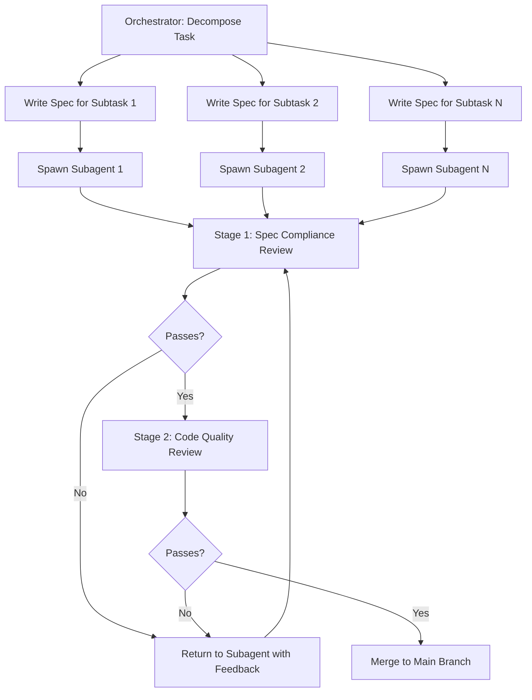

# Subagent-Driven Development

Part of [Agent Skills™](https://github.com/itallstartedwithaidea/agent-skills) by [googleadsagent.ai™](https://googleadsagent.ai)

## Description

Subagent-Driven Development dispatches each discrete task to a fresh subagent with a clean context window, then subjects the output to a two-stage review before merging. The orchestrating agent decomposes work into atomic units, writes precise specifications for each, and spawns isolated subagents that cannot pollute each other's context or carry forward stale assumptions.

Context window contamination is the silent killer of agent code quality. As a conversation grows, early instructions fade, variable names blur, and the agent begins referencing code that has since been refactored. By giving each task a fresh subagent, every implementation starts from a clean slate with only the relevant specification and referenced files. The result is consistently high-quality output regardless of session length.

The two-stage review process catches defects at different abstraction levels. Stage 1 verifies spec compliance: does the output do what was asked? Stage 2 evaluates code quality: is it well-structured, tested, and maintainable? Only code that passes both gates is accepted into the codebase.

## Use When

- A task can be decomposed into 3+ independent subtasks
- The conversation context has grown large enough to risk coherence loss
- Multiple files or modules must be modified in parallel
- You need best-of-N attempts for a complex implementation
- Quality gates must be enforced consistently across all outputs
- The user requests parallel or isolated task execution

## How It Works



The orchestrator never writes implementation code directly. Its role is to decompose, specify, dispatch, and review. Each subagent operates in an isolated git worktree, preventing conflicts between parallel implementations.

## Implementation

```yaml
orchestrator:
  decompose:
    - analyze_task_for_independent_subtasks
    - ensure_each_subtask_has: [clear_input, clear_output, testable_criteria]
    - max_subtask_size: "completable_in_one_session"

  spec_template: |
    ## Subtask: {name}
    **Input**: {files_to_read}
    **Output**: {files_to_create_or_modify}
    **Acceptance Criteria**:
    - {criterion_1}
    - {criterion_2}
    **Constraints**: {architectural_boundaries}
    **Tests**: {required_test_cases}

  dispatch:
    method: "fresh_subagent_per_task"
    isolation: "git_worktree"
    context: "spec_only"  # No conversation history

  review_stage_1_spec_compliance:
    checks:
      - all_acceptance_criteria_met
      - all_required_tests_present_and_passing
      - output_files_match_specification
      - no_unspecified_side_effects

  review_stage_2_code_quality:
    checks:
      - no_linter_errors
      - no_type_errors
      - naming_conventions_followed
      - no_dead_code_or_debug_artifacts
      - error_handling_present
      - documentation_for_public_apis

  merge:
    strategy: "squash_per_subtask"
    commit_message: "feat({subtask_name}): {one_line_summary}"
```

## Best Practices

- Keep subtask specs self-contained—a subagent should need no context beyond the spec
- Include file paths and relevant type signatures in every spec
- Run both review stages even if the code "looks correct" at first glance
- Limit subagent retry attempts to 2 before escalating to the orchestrator
- Use git worktrees for true filesystem isolation between parallel subagents
- Squash-merge each subtask to maintain a clean commit history

## Platform Compatibility

| Platform | Support | Notes |
|----------|---------|-------|
| Cursor | Full | Native Task tool for subagent dispatch |
| VS Code | Partial | Requires manual subprocess management |
| Windsurf | Full | Cascade supports subagent spawning |
| Claude Code | Full | Built-in subagent support |
| Cline | Partial | Plugin-based subagent support |
| aider | Limited | No native subagent capability |

## Related Skills

- [Git Worktrees](../git-worktrees/) - Isolated filesystem workspaces that prevent subagents from clobbering each other's changes
- [Writing Plans](../writing-plans/) - Plan authoring that produces the subtask specifications subagents execute against
- [Code Review](../code-review/) - Two-stage review process that validates subagent outputs before merge
- [Sandbox Hardening](../../security/sandbox-hardening/) - Execution isolation that constrains subagent permissions and resource usage

## Keywords

`subagent` `task-decomposition` `parallel-development` `two-stage-review` `context-isolation` `orchestrator` `spec-driven` `fresh-context`

---

© 2026 googleadsagent.ai™ | Agent Skills™ | MIT License
