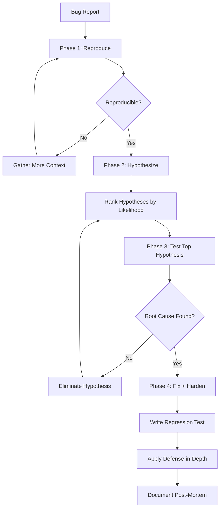

# Systematic Debugging

Part of [Agent Skills™](https://github.com/itallstartedwithaidea/agent-skills) by [googleadsagent.ai™](https://googleadsagent.ai)

## Description

Systematic Debugging replaces trial-and-error fixes with a disciplined four-phase root cause analysis process. The agent reproduces the bug reliably, generates ranked hypotheses, tests each hypothesis with minimal instrumentation, and applies a targeted fix with defense-in-depth hardening. No fix is applied without first understanding why the bug exists.

Agents are prone to "shotgun debugging"—changing multiple things simultaneously and hoping the problem disappears. This skill enforces scientific rigor: one variable at a time, observable evidence at each step, and a clear causal chain from root cause to fix. The agent must articulate the root cause in plain language before writing any corrective code.

After the immediate fix, the agent applies defense-in-depth: adding assertions, input validation, or monitoring that would catch the same class of bug in the future. The debugging session concludes with a post-mortem note documenting the root cause, the fix, and the preventive measures added.

## Use When

- A test fails unexpectedly or intermittently
- A user reports a bug with a stack trace or reproduction steps
- Code behaves differently in production than in development
- An error message is unclear or misleading
- Multiple potential causes exist and guessing would waste time
- A previous fix attempt did not resolve the issue

## How It Works



The four phases enforce a strict progression: you cannot fix what you cannot reproduce, you should not fix what you do not understand, and you must not close a bug without preventing its recurrence.

## Implementation

```python
class DebuggingSession:
    def __init__(self, bug_report):
        self.report = bug_report
        self.hypotheses = []
        self.evidence = []
        self.root_cause = None

    def phase_reproduce(self):
        """Create a minimal, reliable reproduction."""
        minimal_input = self.minimize_reproduction(self.report.steps)
        result = self.execute(minimal_input)
        assert result.matches(self.report.expected_failure), \
            "Cannot proceed without reliable reproduction"
        return ReproductionCase(minimal_input, result)

    def phase_hypothesize(self, repro):
        """Generate ranked hypotheses from evidence."""
        self.hypotheses = [
            Hypothesis("Race condition in async handler", likelihood=0.7),
            Hypothesis("Null reference from cache miss", likelihood=0.5),
            Hypothesis("Stale closure over mutable state", likelihood=0.3),
        ]
        return sorted(self.hypotheses, key=lambda h: -h.likelihood)

    def phase_test(self, hypothesis, repro):
        """Test one hypothesis with minimal instrumentation."""
        probe = self.instrument(hypothesis.target_area)
        result = self.execute_with_probe(repro, probe)
        if result.confirms(hypothesis):
            self.root_cause = hypothesis
        else:
            hypothesis.eliminated = True
            self.evidence.append(result)

    def phase_fix(self):
        """Apply targeted fix with defense-in-depth."""
        fix = self.root_cause.generate_fix()
        regression_test = self.root_cause.generate_regression_test()
        hardening = self.apply_defense_in_depth([
            InputValidation(self.root_cause.entry_point),
            AssertionGuard(self.root_cause.invariant),
            MonitoringAlert(self.root_cause.symptom),
        ])
        return DebugResult(fix, regression_test, hardening)
```

### Root-Cause Tracing Checklist

1. **Read the actual error**, not just the message—examine the full stack trace
2. **Identify the first divergence** from expected behavior, not the crash site
3. **Check recent changes** via `git log --oneline -20` and `git diff`
4. **Verify assumptions** about input data, environment state, and dependencies
5. **Instrument, don't guess**—add logging at the divergence point

## Best Practices

- Always reproduce before hypothesizing; never skip Phase 1
- Limit active hypotheses to 3-5 ranked by likelihood and testability
- Change one variable per test cycle to maintain causal clarity
- Write the regression test before applying the fix
- Apply defense-in-depth: validation, assertions, and monitoring beyond the fix
- Document the root cause even for "obvious" bugs—patterns emerge over time

## Platform Compatibility

| Platform | Support | Notes |
|----------|---------|-------|
| Cursor | Full | Debugger + Shell for reproduction |
| VS Code | Full | Integrated debugger support |
| Windsurf | Full | Terminal-based debugging |
| Claude Code | Full | Shell access for instrumentation |
| Cline | Full | Step-through debugging |
| aider | Partial | Limited to log-based debugging |

## Related Skills

- [Test-Driven Development](../test-driven-development/) - Write the failing test that exposes the bug before applying any fix
- [Code Review](../code-review/) - Review the fix and regression test for quality before merging
- [Agent Security Scanning](../../security/agent-security-scanning/) - Security-focused analysis that may identify vulnerability root causes during debugging

## Keywords

`debugging` `root-cause-analysis` `systematic-debugging` `reproduce-hypothesize-test-fix` `defense-in-depth` `regression-test` `post-mortem` `bug-fix`

---

© 2026 googleadsagent.ai™ | Agent Skills™ | MIT License
