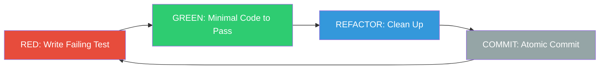

# Test-Driven Development

Part of [Agent Skills™](https://github.com/itallstartedwithaidea/agent-skills) by [googleadsagent.ai™](https://googleadsagent.ai)

## Description

Test-Driven Development enforces the RED-GREEN-REFACTOR discipline on every code change an agent produces. The agent writes a failing test first, confirms the failure, writes the minimal code to pass, confirms the pass, refactors for clarity, and commits. No production code exists without a corresponding test that demanded its creation.

This skill eliminates the most common agent anti-pattern: generating large blocks of untested code that "look right" but silently break under edge cases. By forcing the agent through the TDD cycle, each line of production code is justified by a specific test assertion. The result is a codebase where test coverage is not an afterthought but a structural guarantee.

The cycle integrates directly with version control. Each RED-GREEN-REFACTOR iteration produces an atomic commit, creating a reviewable history of design decisions. The refactor phase is mandatory—the agent must evaluate naming, duplication, and structural clarity before moving to the next feature increment.

## Use When

- Writing any new function, method, or module
- Fixing a bug (write the test that exposes the bug first)
- Refactoring existing code (ensure tests pass before and after)
- The user requests "TDD", "test-first", or "red-green-refactor"
- Building APIs, data transformations, or business logic
- You need confidence that a change does not introduce regressions

## How It Works



**RED**: Write a test that describes the next small behavior increment. Run it. Confirm it fails for the expected reason—not a syntax error or import failure, but a genuine assertion failure. **GREEN**: Write the simplest production code that makes the test pass. Resist the urge to generalize. **REFACTOR**: Improve names, extract duplication, simplify control flow. All tests must still pass. **COMMIT**: Stage and commit with a message referencing the behavior added.

## Implementation

```python
# RED: Write the failing test first
def test_calculate_discount_applies_ten_percent_for_orders_over_100():
    order = Order(items=[Item(price=150.00)])
    result = calculate_discount(order)
    assert result == 135.00  # 10% off

# Run: pytest => FAIL (calculate_discount not defined)

# GREEN: Minimal implementation
def calculate_discount(order):
    total = sum(item.price for item in order.items)
    if total > 100:
        return total * 0.9
    return total

# Run: pytest => PASS

# REFACTOR: Extract magic numbers
DISCOUNT_THRESHOLD = 100
DISCOUNT_RATE = 0.10

def calculate_discount(order):
    total = sum(item.price for item in order.items)
    if total > DISCOUNT_THRESHOLD:
        return total * (1 - DISCOUNT_RATE)
    return total

# Run: pytest => PASS
# git commit -m "feat: apply 10% discount for orders over $100"
```

### Anti-Patterns to Avoid

| Anti-Pattern | Why It Fails |
|---|---|
| Writing tests after code | Tests confirm assumptions, not behavior |
| Testing implementation details | Brittle tests break on valid refactors |
| Skipping the RED step | No proof the test can actually fail |
| Large GREEN steps | Lose traceability of which test drives which code |
| Skipping REFACTOR | Technical debt accumulates silently |

## Best Practices

- Each RED-GREEN-REFACTOR cycle should take under 5 minutes
- If GREEN requires more than 10 lines, the test is too ambitious—split it
- Name tests as behavior specifications: `test_<action>_<condition>_<outcome>`
- Run the full test suite after every REFACTOR, not just the new test
- Commit after each complete cycle to preserve the design narrative
- Use test doubles (mocks, stubs) only at architectural boundaries

## Platform Compatibility

| Platform | Support | Notes |
|----------|---------|-------|
| Cursor | Full | Shell tool runs tests inline |
| VS Code | Full | Terminal integration for test runs |
| Windsurf | Full | Cascade executes test commands |
| Claude Code | Full | Direct shell access for pytest/jest |
| Cline | Full | Configurable test runner |
| aider | Partial | Manual test confirmation needed |

## Related Skills

- [Systematic Debugging](../systematic-debugging/) - Root cause analysis that starts by writing a failing test reproducing the bug
- [Code Review](../code-review/) - Quality gate that verifies test coverage alongside production code changes
- [Subagent-Driven Development](../subagent-driven-development/) - Isolated subagents that follow TDD cycles independently for each subtask

## Keywords

`tdd` `test-driven-development` `red-green-refactor` `failing-test-first` `test-first` `unit-testing` `regression-prevention` `atomic-commits`

---

© 2026 googleadsagent.ai™ | Agent Skills™ | MIT License
