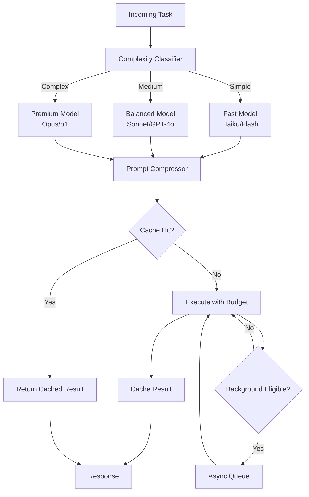

# Token Optimization

Part of [Agent Skills™](https://github.com/itallstartedwithaidea/agent-skills) by [googleadsagent.ai™](https://googleadsagent.ai)

## Description

Token Optimization is the systematic reduction of token expenditure across agent operations without sacrificing output quality. In production AI systems, tokens are the fundamental unit of both cost and latency — every unnecessary token increases API bills and slows response times. This skill codifies the optimization techniques used in the Everything Claude Code ecosystem (150k+ stars) and the [googleadsagent.ai™](https://googleadsagent.ai) production platform, where Buddy™ processes thousands of Google Ads analyses daily within strict cost budgets.

The optimization surface spans four dimensions: model selection (matching task complexity to model capability and cost), prompt compression (removing redundant tokens while preserving instruction fidelity), background processing (offloading expensive operations to async workflows), and caching (avoiding redundant computation for identical or similar inputs). Production systems that implement all four dimensions typically achieve 60-80% token cost reduction compared to naive implementations.

Token optimization is not about being cheap — it is about being efficient. An agent that wastes tokens on verbose system prompts or redundant tool outputs is not only expensive; it fills its context window faster, leaving less room for actual reasoning. Optimization improves both economics and quality simultaneously.

## Use When

- Monthly API costs exceed budget targets for AI agent operations
- Response latency is above acceptable thresholds for user-facing agents
- Context windows are filling up before complex tasks can complete
- Multiple model tiers are available and you need intelligent routing
- Batch processing workloads generate high token volumes
- You need to scale agent usage without proportional cost increases

## How It Works



Tasks enter through a complexity classifier that routes to the appropriate model tier. The prompt compressor strips redundant content, shortens verbose instructions, and replaces narrative descriptions with structured formats. A cache layer intercepts repeated or near-duplicate queries. Background-eligible tasks (non-interactive analysis, batch operations) are queued for async processing outside peak hours. Every stage enforces a token budget that hard-limits expenditure per operation.

## Implementation

**Task Complexity Classifier:**

```python
class ComplexityClassifier:
    THRESHOLDS = {
        "simple": {"max_tokens": 500, "patterns": ["summarize", "format", "list", "count"]},
        "medium": {"max_tokens": 2000, "patterns": ["analyze", "compare", "explain", "review"]},
        "complex": {"max_tokens": 8000, "patterns": ["architect", "refactor", "debug", "optimize"]},
    }

    def classify(self, task: str) -> str:
        task_lower = task.lower()
        scores = {}
        for level, config in self.THRESHOLDS.items():
            score = sum(1 for p in config["patterns"] if p in task_lower)
            scores[level] = score

        if scores["complex"] > 0:
            return "complex"
        if scores["medium"] > 0:
            return "medium"
        return "simple"

    def select_model(self, complexity: str) -> dict:
        models = {
            "simple": {"name": "claude-haiku", "cost_per_1k": 0.00025, "max_tokens": 1024},
            "medium": {"name": "claude-sonnet", "cost_per_1k": 0.003, "max_tokens": 4096},
            "complex": {"name": "claude-opus", "cost_per_1k": 0.015, "max_tokens": 8192},
        }
        return models[complexity]
```

**Prompt Compression Engine:**

```python
class PromptCompressor:
    REPLACEMENTS = [
        (r"\s+", " "),
        (r"Please note that ", ""),
        (r"It is important to ", ""),
        (r"Make sure to ", ""),
        (r"You should ", ""),
        (r"In order to ", "To "),
        (r"At this point in time", "Now"),
    ]

    def compress(self, prompt: str, target_reduction: float = 0.3) -> str:
        compressed = prompt
        for pattern, replacement in self.REPLACEMENTS:
            compressed = re.sub(pattern, replacement, compressed)

        original_tokens = count_tokens(prompt)
        compressed_tokens = count_tokens(compressed)
        reduction = 1 - (compressed_tokens / original_tokens)

        if reduction < target_reduction:
            compressed = self.structural_compress(compressed, target_reduction)

        return compressed.strip()

    def structural_compress(self, text: str, target: float) -> str:
        lines = text.split("\n")
        scored = [(line, self.line_importance(line)) for line in lines]
        scored.sort(key=lambda x: x[1], reverse=True)

        result = []
        tokens = 0
        budget = int(count_tokens(text) * (1 - target))
        for line, score in scored:
            line_tokens = count_tokens(line)
            if tokens + line_tokens <= budget:
                result.append(line)
                tokens += line_tokens
        return "\n".join(result)

    def line_importance(self, line: str) -> float:
        if line.strip().startswith("#"):
            return 1.0
        if any(kw in line.lower() for kw in ["must", "required", "never", "always"]):
            return 0.9
        if line.strip().startswith("-") or line.strip().startswith("*"):
            return 0.7
        return 0.5
```

**Semantic Cache Layer:**

```typescript
import { createHash } from "crypto";

interface CacheEntry {
  result: string;
  timestamp: number;
  tokens_saved: number;
  model: string;
}

class SemanticCache {
  private cache: Map<string, CacheEntry> = new Map();
  private ttlMs: number;
  private totalSaved = 0;

  constructor(ttlMinutes = 60) {
    this.ttlMs = ttlMinutes * 60 * 1000;
  }

  private keyFor(prompt: string, model: string): string {
    const normalized = prompt.toLowerCase().replace(/\s+/g, " ").trim();
    return createHash("sha256").update(`${model}:${normalized}`).digest("hex").slice(0, 32);
  }

  get(prompt: string, model: string): CacheEntry | null {
    const key = this.keyFor(prompt, model);
    const entry = this.cache.get(key);
    if (!entry) return null;
    if (Date.now() - entry.timestamp > this.ttlMs) {
      this.cache.delete(key);
      return null;
    }
    this.totalSaved += entry.tokens_saved;
    return entry;
  }

  set(prompt: string, model: string, result: string, tokensUsed: number): void {
    const key = this.keyFor(prompt, model);
    this.cache.set(key, {
      result,
      timestamp: Date.now(),
      tokens_saved: tokensUsed,
      model,
    });
  }

  stats(): { entries: number; totalTokensSaved: number } {
    return { entries: this.cache.size, totalTokensSaved: this.totalSaved };
  }
}
```

## Best Practices

1. **Measure before optimizing** — instrument token usage per operation type (system prompt, user message, tool results, generation) to identify the highest-impact optimization targets.
2. **Right-size the model** — use fast/cheap models for simple tasks (formatting, summarization) and reserve expensive models for complex reasoning; most tasks don't need the most capable model.
3. **Compress system prompts aggressively** — system prompts are sent with every request; a 30% compression here pays dividends across every invocation.
4. **Cache at the semantic level** — exact-match caching catches duplicates; semantic similarity caching catches near-duplicates that would produce identical results.
5. **Set per-operation token budgets** — hard limits prevent runaway costs from unexpectedly verbose model outputs or circular tool-calling loops.
6. **Prefer structured formats over prose** — JSON and YAML carry more information per token than natural language descriptions.
7. **Truncate tool outputs intelligently** — return only the fields the model needs, not the full API response; a Google Ads API response can be reduced from 50k tokens to 2k tokens with selective field extraction.
8. **Monitor cost per successful task** — track not just raw token usage but tokens-per-completed-task to capture the impact of retries and failures.

## Platform Compatibility

| Feature | Claude Code | Cursor | Codex | Gemini CLI |
|---|---|---|---|---|
| Model routing | ✅ --model flag | ✅ Model selector | ✅ Model config | ✅ Model flag |
| Prompt compression | ✅ Full | ✅ Full | ✅ Full | ✅ Full |
| Response caching | ✅ Custom | ✅ Custom | ✅ Custom | ✅ Context caching |
| Background tasks | ✅ Subagents | ✅ Subagents | ✅ Async | ✅ Async |
| Token budgets | ✅ max_tokens | ✅ max_tokens | ✅ max_tokens | ✅ max_tokens |

## Related Skills

- [Multi-Model Routing](../multi-model-routing/) - Model routing is the highest-leverage technique for token cost reduction
- [Knowledge Base Injection](../knowledge-base-injection/) - Top-K pattern selection prevents context window bloat from excessive injection
- [Memory Persistence](../memory-persistence/) - Memory injection budgets must be balanced against current-task context needs
- [Budget Optimization](../../google-ads/budget-optimization/) - Applies analogous cost-efficiency optimization principles to ad spend allocation

## Keywords

token-optimization, cost-reduction, model-routing, prompt-compression, caching, batch-processing, token-budget, model-selection, latency-optimization, agent-skills

---

© 2026 [googleadsagent.ai™](https://googleadsagent.ai) | [Agent Skills™](https://github.com/itallstartedwithaidea/agent-skills) | MIT License
