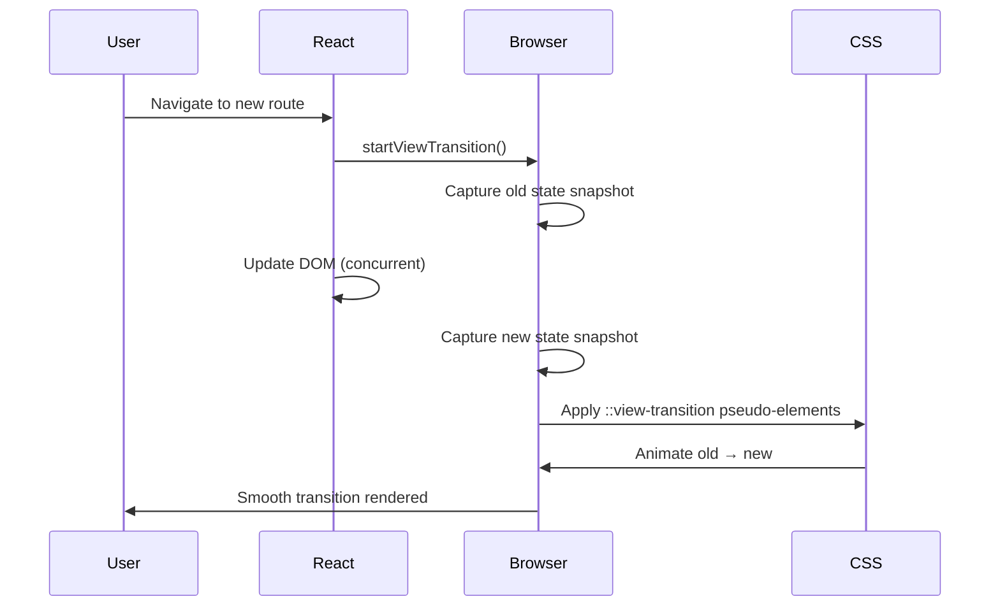

# View Transitions

Part of [Agent Skills™](https://github.com/itallstartedwithaidea/agent-skills) by [googleadsagent.ai™](https://googleadsagent.ai)

## Description

View Transitions implements the React View Transition API for seamless animated transitions between UI states and routes. This skill covers the `<ViewTransition>` component, `addTransitionType` for classifying transitions, CSS pseudo-elements for animation control, shared element transitions across routes, and integration with Next.js App Router.

View transitions eliminate the jarring jump between pages that makes web applications feel inferior to native apps. By capturing a snapshot of the outgoing state and cross-fading it with the incoming state, the browser creates a smooth visual continuity that preserves user context during navigation. React's implementation hooks into the concurrent rendering model, enabling transitions to be interruptible and prioritized.

Shared element transitions take this further: a thumbnail on a list page morphs into a full-size hero image on the detail page, maintaining visual identity across route changes. The CSS `view-transition-name` property establishes the relationship between elements, and the browser handles the interpolation automatically.

## Use When

- Navigating between routes in a React or Next.js application
- Animating list-to-detail transitions with shared elements
- Adding entrance/exit animations to page content
- Implementing back/forward navigation with directional animations
- The user requests smooth page transitions or "native-like" feel
- Replacing manual FLIP animation implementations

## How It Works



The browser orchestrates the transition lifecycle: snapshot capture, DOM update, and cross-fade animation. React's `<ViewTransition>` component manages the timing and classification, while CSS pseudo-elements control the visual animation.

## Implementation

### Basic Route Transition

```tsx
import { ViewTransition } from "react";
import { useRouter } from "next/navigation";

function PageLayout({ children }: { children: React.ReactNode }) {
  return (
    <ViewTransition>
      {children}
    </ViewTransition>
  );
}
```

### Shared Element Transition

```tsx
function ProductCard({ product }: { product: Product }) {
  return (
    <Link href={`/products/${product.id}`}>
      <ViewTransition name={`product-${product.id}`}>
        
      </ViewTransition>
      <h3>{product.name}</h3>
    </Link>
  );
}

function ProductDetail({ product }: { product: Product }) {
  return (
    <article>
      <ViewTransition name={`product-${product.id}`}>
        
      </ViewTransition>
      <h1>{product.name}</h1>
      <p>{product.description}</p>
    </article>
  );
}
```

### Directional Navigation Animation

```tsx
import { addTransitionType } from "react";

function handleNavigation(direction: "forward" | "back") {
  addTransitionType(direction);
  router.push(targetUrl);
}
```

```css
::view-transition-old(root) {
  animation: slide-out 200ms ease-in;
}
::view-transition-new(root) {
  animation: slide-in 200ms ease-out;
}

@keyframes slide-out { to { transform: translateX(-100%); opacity: 0; } }
@keyframes slide-in { from { transform: translateX(100%); opacity: 0; } }

/* Reverse for back navigation */
[data-transition-type="back"]::view-transition-old(root) {
  animation: slide-in 200ms ease-in reverse;
}
[data-transition-type="back"]::view-transition-new(root) {
  animation: slide-out 200ms ease-out reverse;
}
```

## Best Practices

- Assign unique `view-transition-name` values—duplicates cause silent failures
- Keep transition durations under 300ms to feel responsive, not sluggish
- Respect `prefers-reduced-motion` by disabling or shortening animations
- Use `addTransitionType` to differentiate forward, back, and lateral navigation
- Test transitions with slow network and CPU throttling enabled
- Provide fallback behavior for browsers that do not support the View Transition API

## Platform Compatibility

| Platform | Support | Notes |
|----------|---------|-------|
| Cursor | Full | React + Next.js aware |
| VS Code | Full | CSS pseudo-element support |
| Windsurf | Full | Frontend framework support |
| Claude Code | Full | Code generation |
| Cline | Full | React component generation |
| aider | Partial | Limited CSS context |

## Related Skills

- [Composition Patterns](../composition-patterns/)
- [React Best Practices](../react-best-practices/)
- [Web Design Guidelines](../web-design-guidelines/)
- [Edge Rendering](../../infrastructure/edge-rendering/)

## Keywords

`view-transitions` `react` `shared-elements` `page-transitions` `animation` `next-js` `css-pseudo-elements` `cross-fade` `route-animation`

---

© 2026 googleadsagent.ai™ | Agent Skills™ | MIT License
