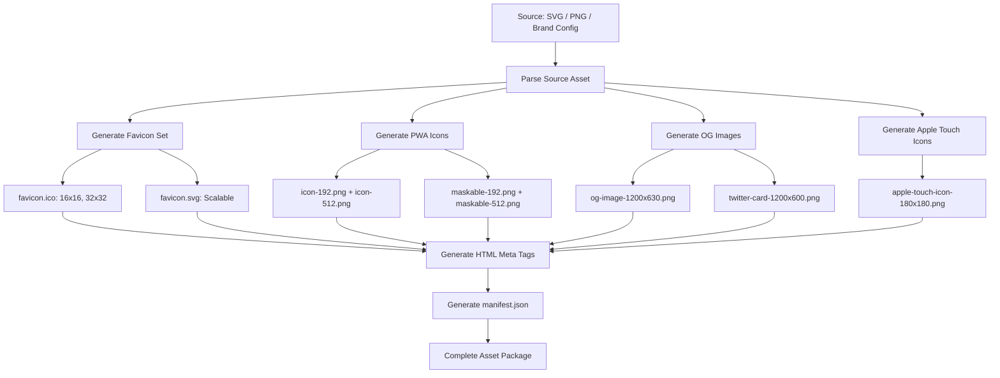

# Web Asset Generation

Part of [Agent Skills™](https://github.com/itallstartedwithaidea/agent-skills) by [googleadsagent.ai™](https://googleadsagent.ai)

## Description

Web Asset Generation automates the creation of favicons, PWA icons, Open Graph images, social media meta tags, and Apple touch icons from a single source image or brand specification. The agent produces the complete set of assets required for a modern web application—across all platforms, sizes, and formats—with proper HTML meta tags and web manifest configuration.

A professional web presence requires dozens of image variants: 16x16 and 32x32 favicons, 180x180 Apple touch icons, 192x192 and 512x512 PWA icons in both regular and maskable formats, 1200x630 Open Graph images, 1200x600 Twitter cards, and platform-specific splash screens. Generating these manually is tedious and error-prone; forgetting a single variant means broken previews on a specific platform. This skill automates the entire pipeline.

Beyond icon generation, the skill produces the associated configuration: HTML `<link>` and `<meta>` tags for the document head, `manifest.json` for PWA support, and platform-specific meta tags for Twitter Cards, Facebook Open Graph, and LinkedIn. The output is copy-paste ready—a complete set of assets with the HTML to reference them.

## Use When

- Setting up favicon and icon assets for a new web project
- Generating Open Graph images for social media sharing
- Configuring PWA manifest with proper icon sizes
- Creating social media meta tags (Twitter Cards, OG tags)
- Rebuilding assets after a brand update or redesign
- The user asks for "favicon", "OG image", "PWA icons", or "social meta tags"

## How It Works



A single source asset flows through parallel generation pipelines, producing all required size variants and formats. The final step generates the HTML and manifest configuration to wire everything together.

## Implementation

```typescript
import sharp from "sharp";
import { writeFileSync, mkdirSync } from "fs";

interface AssetConfig {
  source: string;
  outputDir: string;
  siteName: string;
  siteUrl: string;
  themeColor: string;
  backgroundColor: string;
  description: string;
}

const ICON_SIZES = {
  "favicon-16x16.png": { width: 16, height: 16 },
  "favicon-32x32.png": { width: 32, height: 32 },
  "apple-touch-icon.png": { width: 180, height: 180 },
  "icon-192x192.png": { width: 192, height: 192 },
  "icon-512x512.png": { width: 512, height: 512 },
  "maskable-192x192.png": { width: 192, height: 192, maskable: true },
  "maskable-512x512.png": { width: 512, height: 512, maskable: true },
};

async function generateIcons(config: AssetConfig): Promise<void> {
  mkdirSync(config.outputDir, { recursive: true });
  const source = sharp(config.source);

  for (const [filename, size] of Object.entries(ICON_SIZES)) {
    let pipeline = source.clone().resize(size.width, size.height, { fit: "contain" });

    if ((size as { maskable?: boolean }).maskable) {
      const padding = Math.round(size.width * 0.1);
      pipeline = source.clone().resize(size.width - padding * 2, size.height - padding * 2, { fit: "contain" })
        .extend({ top: padding, bottom: padding, left: padding, right: padding, background: config.backgroundColor });
    }

    await pipeline.png().toFile(`${config.outputDir}/${filename}`);
  }
}

async function generateOgImage(config: AssetConfig): Promise<void> {
  const width = 1200, height = 630;
  const svg = `<svg width="${width}" height="${height}" xmlns="http://www.w3.org/2000/svg">
    <rect width="${width}" height="${height}" fill="${config.themeColor}"/>
    <text x="50%" y="45%" text-anchor="middle" font-size="64" font-weight="bold" fill="white" font-family="system-ui">${config.siteName}</text>
    <text x="50%" y="60%" text-anchor="middle" font-size="28" fill="rgba(255,255,255,0.8)" font-family="system-ui">${config.description}</text>
  </svg>`;

  await sharp(Buffer.from(svg)).png().toFile(`${config.outputDir}/og-image.png`);
}

function generateManifest(config: AssetConfig): object {
  return {
    name: config.siteName,
    short_name: config.siteName,
    start_url: "/",
    display: "standalone",
    theme_color: config.themeColor,
    background_color: config.backgroundColor,
    icons: [
      { src: "/icon-192x192.png", sizes: "192x192", type: "image/png" },
      { src: "/icon-512x512.png", sizes: "512x512", type: "image/png" },
      { src: "/maskable-192x192.png", sizes: "192x192", type: "image/png", purpose: "maskable" },
      { src: "/maskable-512x512.png", sizes: "512x512", type: "image/png", purpose: "maskable" },
    ],
  };
}

function generateHtmlTags(config: AssetConfig): string {
  return `<!-- Favicons -->
<link rel="icon" type="image/png" sizes="32x32" href="/favicon-32x32.png">
<link rel="icon" type="image/png" sizes="16x16" href="/favicon-16x16.png">
<link rel="apple-touch-icon" sizes="180x180" href="/apple-touch-icon.png">
<link rel="manifest" href="/manifest.json">
<meta name="theme-color" content="${config.themeColor}">

<!-- Open Graph -->
<meta property="og:type" content="website">
<meta property="og:title" content="${config.siteName}">
<meta property="og:description" content="${config.description}">
<meta property="og:image" content="${config.siteUrl}/og-image.png">
<meta property="og:url" content="${config.siteUrl}">

<!-- Twitter Card -->
<meta name="twitter:card" content="summary_large_image">
<meta name="twitter:title" content="${config.siteName}">
<meta name="twitter:description" content="${config.description}">
<meta name="twitter:image" content="${config.siteUrl}/og-image.png">`;
}
```

## Best Practices

- Start from an SVG source for lossless scaling across all icon sizes
- Include both regular and maskable PWA icons—Android adaptive icons crop aggressively
- Set Open Graph image dimensions to exactly 1200x630 for optimal social media display
- Add `<meta name="theme-color">` for mobile browser chrome coloring
- Test OG images with platform debuggers (Facebook Sharing Debugger, Twitter Card Validator)
- Regenerate all assets when the brand identity changes—partial updates cause inconsistency

## Platform Compatibility

| Platform | Support | Notes |
|----------|---------|-------|
| Cursor | Full | Sharp + file generation |
| VS Code | Full | Image preview + config |
| Windsurf | Full | Asset pipeline support |
| Claude Code | Full | Script generation |
| Cline | Full | Build pipeline setup |
| aider | Partial | Config file generation |

## Related Skills

- [Programmatic Video](../programmatic-video/)
- [ML Model Integration](../ml-model-integration/)
- [Web Design Guidelines](../../web-frontend/web-design-guidelines/)
- [Low-Code Generation](../../productivity/low-code-generation/)

## Keywords

`favicon` `pwa-icons` `open-graph` `og-image` `twitter-card` `web-manifest` `social-meta-tags` `asset-pipeline`

---

© 2026 googleadsagent.ai™ | Agent Skills™ | MIT License
