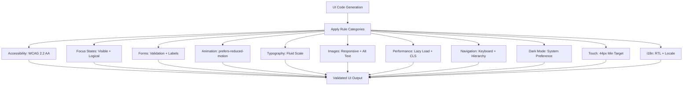

# Web Design Guidelines

Part of [Agent Skills™](https://github.com/itallstartedwithaidea/agent-skills) by [googleadsagent.ai™](https://googleadsagent.ai)

## Description

Web Design Guidelines encodes 100+ rules covering accessibility, focus states, forms, animation, typography, images, performance, navigation, dark mode, touch targets, and internationalization. The agent applies these rules when generating UI code, reviewing designs, or building new pages, producing interfaces that are accessible, performant, and visually consistent by default.

These guidelines synthesize WCAG 2.2 AA requirements, platform-specific HIG conventions, and empirically validated UX patterns into a single actionable ruleset. Rather than treating accessibility as an afterthought or a compliance checkbox, these rules embed it into the generation process: every component is keyboard-navigable, every image has alt text, every color combination meets contrast ratios, and every interactive element has visible focus indicators.

The rules extend beyond accessibility into comprehensive design quality: responsive typography scales, motion preferences, form validation patterns, image optimization, navigation hierarchy, dark mode implementation, touch-friendly sizing, and RTL/i18n support. The result is production-grade UI code that works for all users across all contexts.

## Use When

- Generating new UI components or pages
- Reviewing frontend code for accessibility compliance
- Implementing dark mode or theme switching
- Building forms with validation
- Adding animations or transitions
- Optimizing images and media
- Supporting internationalization or RTL layouts

## How It Works



Every generated component passes through all applicable rule categories before output. Rules are non-negotiable for accessibility; other categories are applied based on component type.

## Implementation

```css
/* Focus: Always visible, high contrast */
:focus-visible {
  outline: 2px solid var(--color-focus);
  outline-offset: 2px;
}

/* Animation: Respect user preference */
@media (prefers-reduced-motion: reduce) {
  *, *::before, *::after {
    animation-duration: 0.01ms !important;
    transition-duration: 0.01ms !important;
  }
}

/* Typography: Fluid responsive scale */
:root {
  --step-0: clamp(1rem, 0.34vw + 0.91rem, 1.19rem);
  --step-1: clamp(1.2rem, 0.61vw + 1.07rem, 1.58rem);
  --step-2: clamp(1.44rem, 0.98vw + 1.24rem, 2.11rem);
}

/* Dark mode: System preference + manual toggle */
@media (prefers-color-scheme: dark) {
  :root:not([data-theme="light"]) {
    --bg: #0a0a0a;
    --fg: #ededed;
  }
}

/* Touch: Minimum 44px targets */
button, a, [role="button"] {
  min-height: 44px;
  min-width: 44px;
}
```

```tsx
// Form: Accessible label + validation + error association
function EmailField({ error }: { error?: string }) {
  const id = useId();
  return (
    <div>
      <label htmlFor={id}>Email address</label>
      <input
        id={id}
        type="email"
        aria-invalid={!!error}
        aria-describedby={error ? `${id}-error` : undefined}
        autoComplete="email"
      />
      {error && <p id={`${id}-error`} role="alert">{error}</p>}
    </div>
  );
}
```

## Best Practices

- Test every page with keyboard-only navigation before shipping
- Maintain a minimum 4.5:1 contrast ratio for normal text, 3:1 for large text
- Use semantic HTML elements before reaching for ARIA attributes
- Provide visible focus indicators that work on both light and dark backgrounds
- Set explicit `width` and `height` on images to prevent CLS
- Support `prefers-reduced-motion`, `prefers-color-scheme`, and `prefers-contrast`

## Platform Compatibility

| Platform | Support | Notes |
|----------|---------|-------|
| Cursor | Full | CSS + JSX generation |
| VS Code | Full | axe-core integration |
| Windsurf | Full | Accessibility-aware output |
| Claude Code | Full | HTML/CSS generation |
| Cline | Full | Rule-based UI review |
| aider | Partial | Limited design context |

## Related Skills

- [Composition Patterns](../composition-patterns/)
- [React Best Practices](../react-best-practices/)
- [View Transitions](../view-transitions/)
- [Edge Rendering](../../infrastructure/edge-rendering/)

## Keywords

`web-design` `accessibility` `wcag` `dark-mode` `responsive` `typography` `forms` `focus-states` `touch-targets` `i18n` `animation` `performance`

---

© 2026 googleadsagent.ai™ | Agent Skills™ | MIT License
