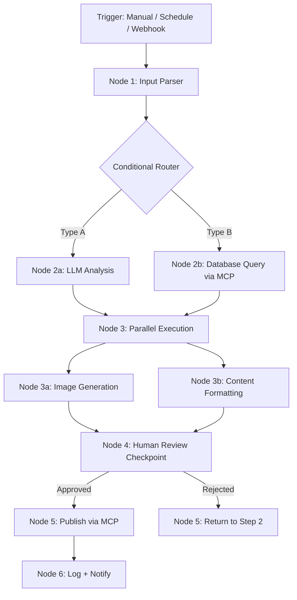

# Workflow Orchestration

Part of [Agent Skills™](https://github.com/itallstartedwithaidea/agent-skills) by [googleadsagent.ai™](https://googleadsagent.ai)

## Description

Workflow Orchestration provides a visual AI flow-building framework with MCP plugin support, conditional branching, parallel execution, and error recovery. The agent designs and implements multi-step workflows that chain AI operations, data transformations, and external service calls into reliable, repeatable automation pipelines.

Individual AI calls are useful; orchestrated workflows are transformative. A content pipeline that drafts text, fact-checks claims, generates images, formats for multiple platforms, and schedules publication—all triggered by a single input—replaces hours of manual coordination. This skill encodes the patterns for building such workflows: DAG-based execution, conditional routing, retry logic, and human-in-the-loop checkpoints.

The MCP (Model Context Protocol) plugin system extends workflows with external capabilities: database queries, file operations, API calls, and browser automation. Each MCP tool becomes a reusable node in the workflow graph, enabling agents to interact with any system that exposes an MCP interface. Workflows compose these nodes into complex automations without custom integration code.

## Use When

- Building multi-step AI automation pipelines
- Chaining LLM calls with data transformations and API integrations
- Implementing conditional logic in AI workflows (if/else, switch)
- Adding human-in-the-loop approval steps to automated processes
- Integrating MCP tools into repeatable workflows
- Orchestrating parallel AI tasks with dependency management

## How It Works



Workflows are directed acyclic graphs (DAGs) where each node is a discrete operation. The orchestrator manages execution order, passes data between nodes, handles retries on failure, and pauses at human checkpoints.

## Implementation

```typescript
interface WorkflowNode {
  id: string;
  type: "llm" | "mcp" | "transform" | "condition" | "human_review" | "parallel";
  config: Record<string, unknown>;
  next: string | string[] | ConditionalNext[];
  retries?: number;
  timeout_ms?: number;
}

interface ConditionalNext {
  condition: string;
  target: string;
}

interface Workflow {
  id: string;
  name: string;
  trigger: { type: "manual" | "schedule" | "webhook"; config: Record<string, unknown> };
  nodes: WorkflowNode[];
}

class WorkflowEngine {
  private state = new Map<string, unknown>();

  async execute(workflow: Workflow, input: unknown): Promise<unknown> {
    this.state.set("input", input);
    let currentNode = workflow.nodes[0];

    while (currentNode) {
      const result = await this.executeNode(currentNode);
      this.state.set(currentNode.id, result);

      const nextId = this.resolveNext(currentNode, result);
      currentNode = nextId ? workflow.nodes.find(n => n.id === nextId)! : undefined!;
    }

    return Object.fromEntries(this.state);
  }

  private async executeNode(node: WorkflowNode): Promise<unknown> {
    for (let attempt = 0; attempt <= (node.retries ?? 0); attempt++) {
      try {
        switch (node.type) {
          case "llm": return await this.executeLLM(node.config);
          case "mcp": return await this.executeMCP(node.config);
          case "transform": return this.executeTransform(node.config);
          case "parallel": return await this.executeParallel(node.config);
          case "human_review": return await this.waitForHumanReview(node.config);
          default: throw new Error(`Unknown node type: ${node.type}`);
        }
      } catch (error) {
        if (attempt === (node.retries ?? 0)) throw error;
        await this.delay(1000 * Math.pow(2, attempt));
      }
    }
  }

  private async executeMCP(config: Record<string, unknown>): Promise<unknown> {
    const { server, tool, arguments: args } = config as {
      server: string; tool: string; arguments: Record<string, unknown>;
    };
    return callMcpTool(server, tool, this.interpolate(args));
  }

  private async executeParallel(config: Record<string, unknown>): Promise<unknown[]> {
    const { nodeIds } = config as { nodeIds: string[] };
    const nodes = nodeIds.map(id => this.findNode(id));
    return Promise.all(nodes.map(n => this.executeNode(n)));
  }

  private interpolate(obj: Record<string, unknown>): Record<string, unknown> {
    return JSON.parse(
      JSON.stringify(obj).replace(/\{\{(\w+)\.(\w+)\}\}/g, (_, nodeId, key) => {
        const nodeResult = this.state.get(nodeId) as Record<string, unknown>;
        return String(nodeResult?.[key] ?? "");
      })
    );
  }
}
```

## Best Practices

- Design workflows as DAGs—cycles indicate a design flaw, not a feature
- Set timeouts on every node to prevent indefinite hangs from external services
- Implement exponential backoff retries for transient failures (network, rate limits)
- Place human review checkpoints before irreversible actions (publish, delete, send)
- Log every node execution with input, output, duration, and attempt count
- Use MCP tools for external integrations rather than hardcoded API clients

## Platform Compatibility

| Platform | Support | Notes |
|----------|---------|-------|
| Cursor | Full | MCP integration + workflow design |
| VS Code | Full | Extension-based workflow |
| Windsurf | Full | Flow builder support |
| Claude Code | Full | Workflow code generation |
| Cline | Full | Pipeline orchestration |
| aider | Partial | Code-level workflow support |

## Related Skills

- [Batch Processing](../batch-processing/)
- [AI Chat Studio](../ai-chat-studio/)
- [Parallel Agent Orchestration](../../ai-agent-engineering/parallel-agent-orchestration/)
- [MCP Server Creation](../../ai-agent-engineering/mcp-server-creation/)

## Keywords

`workflow` `orchestration` `mcp` `dag` `parallel-execution` `conditional-routing` `human-in-the-loop` `automation`

---

© 2026 googleadsagent.ai™ | Agent Skills™ | MIT License
