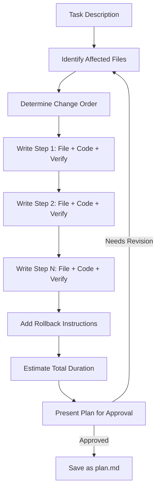

# Writing Plans

Part of [Agent Skills™](https://github.com/itallstartedwithaidea/agent-skills) by [googleadsagent.ai™](https://googleadsagent.ai)

## Description

Writing Plans decomposes any implementation task into a sequence of atomic steps, each completable in 2-5 minutes, with exact file paths, complete code blocks, and verification commands. The plan is a self-contained execution script that another agent—or a future version of the same agent—can follow without needing the original conversation context.

The critical distinction between a plan and a TODO list is specificity. A plan does not say "update the API handler." It says "in `src/api/routes/users.ts`, add a `GET /users/:id/preferences` handler at line 47 that returns a `UserPreferences` object with fields `theme`, `locale`, and `notifications`, validated by the `preferencesSchema` defined in `src/api/schemas.ts`." Every step is unambiguous enough to execute mechanically.

Plans include verification steps after each implementation step: a test to run, a curl command to execute, or a UI state to confirm. This tight feedback loop ensures errors are caught immediately rather than compounding across subsequent steps.

## Use When

- A task involves modifying 3+ files
- The implementation path is known but the execution is non-trivial
- Work needs to be handed off to another agent or resumed later
- The user asks for a plan, roadmap, or step-by-step breakdown
- You need to estimate effort before committing to implementation
- Complex refactoring requires precise ordering of changes

## How It Works



Each plan step follows a rigid structure: the file to modify, the exact code change (with before/after context), and the verification command to confirm the step succeeded. Steps are ordered to maintain a working codebase at every checkpoint.

## Implementation

```markdown
# Plan: Add User Preferences API

**Estimated Duration**: 15 minutes (5 steps × 3 min avg)
**Affected Files**: 4 files modified, 1 file created

## Step 1: Define Schema (2 min)
**File**: `src/api/schemas.ts`
**Action**: Add after line 23

  export const preferencesSchema = z.object({
    theme: z.enum(["light", "dark", "system"]).default("system"),
    locale: z.string().regex(/^[a-z]{2}-[A-Z]{2}$/).default("en-US"),
    notifications: z.boolean().default(true),
  });
  export type UserPreferences = z.infer<typeof preferencesSchema>;

**Verify**: `npx tsc --noEmit` exits 0

## Step 2: Add Database Migration (3 min)
**File**: `src/db/migrations/004_user_preferences.sql` (CREATE)

  CREATE TABLE user_preferences (
    user_id TEXT PRIMARY KEY REFERENCES users(id),
    theme TEXT NOT NULL DEFAULT 'system',
    locale TEXT NOT NULL DEFAULT 'en-US',
    notifications BOOLEAN NOT NULL DEFAULT true
  );

**Verify**: `npx wrangler d1 migrations apply buddy-brain --local`

## Step 3: Add Route Handler (3 min)
**File**: `src/api/routes/users.ts`
**Action**: Add after the existing GET /users/:id handler

  // ... [complete handler code here]

**Verify**: `curl localhost:8787/users/test-id/preferences` returns 200
```

## Best Practices

- Each step must leave the codebase in a compilable, runnable state
- Include the full code for each change—never write "similar to above"
- Order steps to resolve dependencies first (schemas before handlers, types before implementations)
- Add rollback instructions for destructive changes (migrations, deletions)
- Keep steps to 2-5 minutes; split anything larger
- Include line numbers or surrounding context to locate insertion points precisely

## Platform Compatibility

| Platform | Support | Notes |
|----------|---------|-------|
| Cursor | Full | Plans saved as workspace files |
| VS Code | Full | Markdown plan files |
| Windsurf | Full | Plan-and-execute workflow |
| Claude Code | Full | TodoWrite + plan files |
| Cline | Full | Task-based planning |
| aider | Full | Commit-per-step execution |

## Related Skills

- [Brainstorming](../brainstorming/) - Socratic design refinement that produces the design briefs plans are written from
- [Executing Plans](../executing-plans/) - Batch execution engine that drives written plans through verification and rollback
- [Subagent-Driven Development](../subagent-driven-development/) - Task decomposition that converts plan steps into isolated subagent specifications

## Keywords

`planning` `task-decomposition` `step-by-step` `implementation-plan` `file-paths` `verification-steps` `atomic-steps` `handoff-ready`

---

© 2026 googleadsagent.ai™ | Agent Skills™ | MIT License
